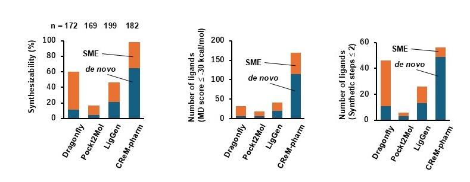

# AiZynth-based Molecule Exploration Tools

This repository contains two computational tools for exploring and optimizing synthesizable molecules based on an original molecular skeleton. These tools utilize [AiZynthFinder](https://github.com/MolecularAI/aizynthfinder) to evaluate the synthesizability and synthetic routes of the generated mutants.



## Tools Overview


### 1. Synthesizable Molecular Explorer (SME) Tool
**Script**: `synthesizable_molecular_explorer.py`
**Purpose**: Explores variants of a molecule with the goal of simply finding a synthesizable analog. It generates structural mutants and stops searching for a specific ligand as soon as a synthesizable structure is found.

### 2. Reducing Synthetic Steps (RSS) Tool
**Script**: `reducing_synthetic_steps.py`
**Purpose**: Searches for molecules with a similar molecular skeleton but fewer synthetic steps than the original molecule. It mutates the specified atoms and systematically runs retrosynthetic planning.

## Prerequisites & Installation
These tools require Python and the following external packages:
- `rdkit (ver. Release_2026.03.5)`
- `aizynthfinder (ver. 4.4.1)`

It is highly recommended to set up a dedicated conda environment. You can install the required packages as follows:

```bash
conda create -n aizynth-env python=3.10
conda activate aizynth-env
conda install -c conda-forge rdkit
pip install aizynthfinder
```

For more detailed instructions on installing and configuring AiZynthFinder (including downloading the required policy models and stock databases), please refer to the [Official AiZynthFinder Documentation](https://github.com/MolecularAI/aizynthfinder).

## How to Use

### Synthesizable Molecular Explorer (SME)
1. Prepare your input or configure `sme_config.ini`.
2. Run the script:
   ```bash
   python synthesizable_molecular_explorer.py --ini sme_config.ini
   ```

### Reducing Synthetic Steps (RSS)
1. Prepare your input in a file (e.g., `input.smi`) or directly in `rss_config.ini`.
2. Configure `rss_config.ini` with your AiZynthFinder config, mutation rules, and parallel job count.
3. Run the script:
   ```bash
   python reducing_synthetic_steps.py --ini rss_config.ini
   ```

## Configuration Files (`.ini`)
Both tools use `.ini` configuration files. Below are the key settings:
* **[Execution]**: Input smiles/batch file, `config.yml` (AiZynthFinder configuration), sample size, and number of parallel jobs.
* **[Settings]**: Atoms allowed for mutation (e.g., `C, N, O, S, F, Cl, Br`), mutation probability weights, and allowed C/N ratio boundaries.
* **[MaxCounts]**: Hard constraints on the maximum occurrence of specific atoms.
* **[ProtectedSMARTS]**: Protects specific functional groups from being mutated (e.g., carboxyl, ketone, primary amine).

## Output Results
Outputs are generated in `rss_results/` and `sme_results/` folders respectively.
1. **`summary.csv`**: A summary table of all processed ligands, including the number of successful mutants and minimum synthetic steps.
2. **`<ligand_name>/`**: A folder containing:
   * `mutants_summary.csv` - List of successful mutants and image filenames.
   * `*.png` - The actual synthetic route tree images proposed by AiZynthFinder.

## License
This project is licensed under the MIT License - see the [LICENSE](LICENSE) file for details.

## Contact
Kohji Murase, PhD, Yokohama City University, murase.koj.bc@yokohama-cu.ac.jp
# SME_RSS
